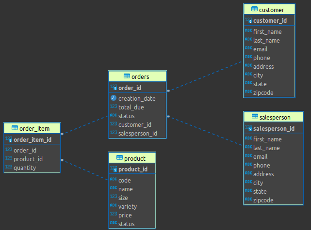

# Introduction
This application makes a connection to a PostgreSQL database using Java Database Connectivity (JDBC).
This database contains information on Customer, Prodcuts, and Salespoerson.
Using this application you can perform all CRUD opperations on this database to easily modify the data.

# ER Diagram

# Design Patterns
Data Access Object(DAO) pattern was used to separate the data access code from the business logic.
This was done using a DAO interface and implementation.  The interface specified all operations to
be done on the database such as insert, delete and update for a specific table. 

You can use the DAO to easily access and modify data in a table without having to worry about things
like how insert into a specific table using sql statements.

# Test
A database administration tool called DBeaver was used to connect to the database and view its content.
All CRUD operations were tested on the database one by one for correct and wrong output.
The output was checked to see if it gave appropriate response for correct and wrong output.
DBeaver was used to verify if the resuls were visible there as well.