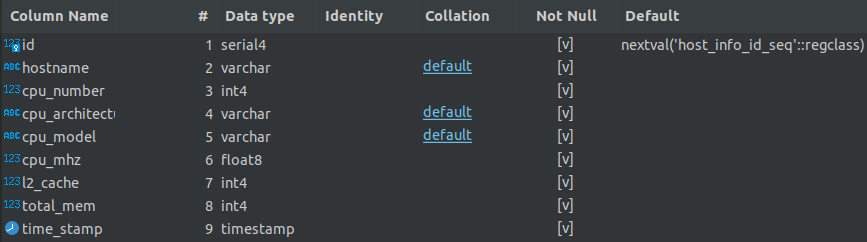
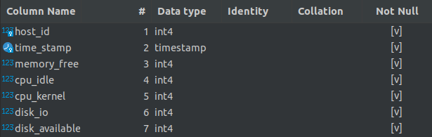

# Introduction
Developed a monitoring agent program using Bash scripts for Linux OS. 
This program collects hardware specification and resource usage data for the system and then stores it into a relational database.
The database to store the information was created using PostgreSQL linux docker image.

# Quick Start
- Provision psql instance using docker - use <b>psql_docker.sh</b>:
    - This Script takes 3 arguments:
      1. operation to perform: create,start,stop
      2. username for database owner
      3. password
      
      <b>./scripts/psql_docker.sh start|stop|create [db_username][db_password]</b>
      

- Create host_info and host_usage tables using ddl.sql:
    - psql -h localhost -U postgres -d host_agent -f sql/ddl.sql
             
           Flags:
            - -h database server host
            - -U database user name
            - -d database name
            - -f file to execute commands from
    
- Insert <u>hardware specs</u> data into the DB using host_info.sh
    - This Script takes 5 arguments:
        1. host
        2. port postgres is listening on
        3. database name
        4. database user name
        5. password

    - <b>example: ./scripts/host_info.sh localhost 5432 host_agent postgres password</b>

- Insert <u>hardware usage</u> data into the DB using host_usage.sh
    - This Script takes 5 arguments:
        1. host
        2. port postgres is listening on
        3. database name
        4. database user name
        5. password

    - <b>example: ./scripts/host_usage.sh localhost 5432 host_agent postgres password</b>
  

- Crontab setup
    - On linux you can automate hardware usage script to runs at a set interval and stores hardware usage data into the database
        
            Usage:
                - Open Terminal
                - edit crontab file by typing: Crontab -e
                - add to file: 
                    - * * * * * [path to host_usage script] [arguments to host_usage script]
                        - * * * * * tells crontab to run script every minute. You can change this to run at different interval
                    - example: /home/my_linux/Desktop/jarvis_data_eng_FaizanAli/linux_sql/scripts/host_usage.sh localhost 5432 host_agent postgres password
    

## Scripts
- psql_docker.sh: Can be used to create, start and stop a psql instance using docker
- Host Info script: Collect hardware specifications and inserts them into the appropriate table
- Usage Infor script: Collect server usage data and insert it into the appropriate table. This script is executed every minute using Linux crontab to allow us to get data at regular intervals on usage.
- queries.sql: Used to get hardware specification and resource usage information stored in the database. This is used to understand how much resources are being used on average and make appropriate changes as required.

## Database Modeling
- `host_info`

- `host_usage`

# Deployment
- The database ran on a docker container (localy)
- The host_info script was only run once at start as hardware did not change
- Crontab was used to automate host_usage script to run every minute. 

# Improvements
- handle hardware update
- Run docker container on cloud so anyone can access it
- GUI to allow user to specify how often to run host_usage script